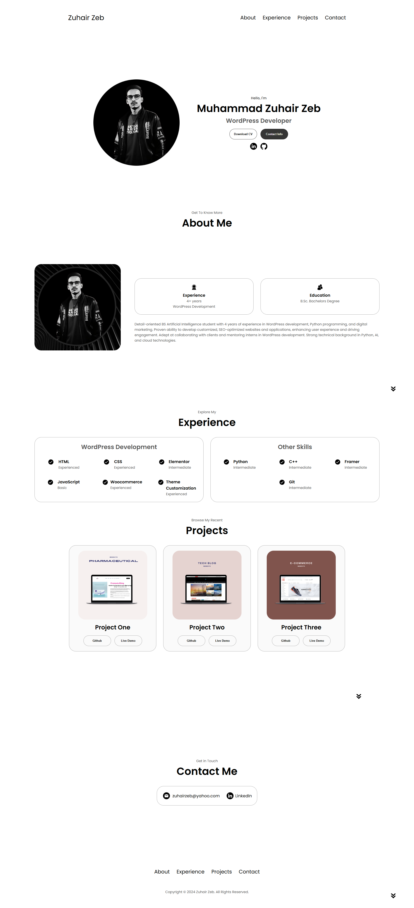

Portfolio Website 🌐

  

🚀 Overview
This is my personal portfolio website showcasing my skills, projects, and experience as a [WordPress Developer | AI Student | Python Programmer | Digital Marketer]. The website features a clean, responsive design and highlights my professional journey effectively.

🛠️ Features
Home Section: Introduction with a professional summary.
Skills Section: Showcasing technical and professional expertise.
Projects Section: Highlighted projects with detailed descriptions.
Contact Section: Interactive form for inquiries and collaboration.
Responsive Design: Optimized for various devices.
Fast Loading: Designed for speed and accessibility.

⭐ If you find this portfolio helpful or inspiring, please give it a star!